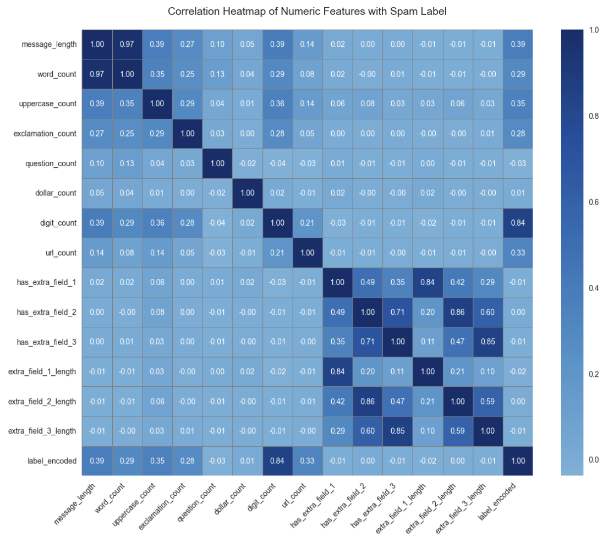

# SMS Spam Collection Deep Learning

- **GitHub Repo**: https://github.com/GHeart01/SMS-Spam-Collection-Deep-Learning
- **YouTube**: [Add link when available]

## Table of Contents
- [Description](#description)
- [Exploratory Data Analysis](#exploratory-data-analysis)
- [Model](#model)
- [Hyperparameter Tuning](#hyperparameter-tuning)
- [Results and Analysis](#results-and-analysis)
- [Conclusion](#conclusion)
- [Citation](#citation)

## Description

In this project, my goal is to build a model to predict which text messages are spam. The messages are classified as ham (legitimate) or spam. According to the Kaggle description, the dataset contains 4,825 ham messages and 747 spam SMS messages. A set of 3,375 messages have been chosen as ham messages, representing a subset of about 10,000 messages from the NUS SMS Corpus (NSC).

I approach this problem by conducting a thorough exploratory data analysis to understand the data structure and determine if any transformations need to be applied before model training.



## Exploratory Data Analysis

### Data Loading and Initial Inspection

```python
import pandas as pd
import numpy as np
import matplotlib.pyplot as plt
import seaborn as sns
from scipy import stats
from sklearn.preprocessing import LabelEncoder
import re
import warnings
warnings.filterwarnings('ignore')

df = pd.read_csv("spam.csv", encoding='latin-1')  # Handle non-UTF-8 characters
print(df.info())
```

### Data Quality Assessment

Despite the DataFrame head and tail showing only null values in columns 3, 4, and 5, `df.info()` reveals these columns contain some non-null values. I investigated why they were included in the dataset:

```python
# Check what's in Unnamed: 2 (50 non-null values)
print("Unnamed: 2 column analysis:")
unnamed_2_data = df['Unnamed: 2'].dropna()
print(f"Value counts:")
print(unnamed_2_data.value_counts().head(10))

# Similar analysis for Unnamed: 3 and 4...
```

**Findings**: The unnamed columns 2, 3, and 4 contain message endings for very long texts, quotes, addresses, and many misspelled words. I retained this data as they may serve as indicators of spam messages.

### Feature Engineering

I enhanced the dataset by creating descriptive features from the existing data. The original columns were fairly undescriptive, so I added the following engineered features:

- `message_length`: Character count of the message
- `word_count`: Number of words in the message
- `uppercase_count`: Number of uppercase characters
- `exclamation_count`: Number of exclamation marks
- `question_count`: Number of question marks
- `dollar_count`: Number of dollar signs
- `digit_count`: Number of digits
- `url_count`: Number of URLs detected

```python
# Rename columns for clarity
df_analysis = df.copy()
df_analysis.columns = ['label', 'message', 'extra_field_1', 'extra_field_2', 'extra_field_3']

# Create binary indicators for presence of extra fields
df_analysis['has_extra_field_1'] = df_analysis['extra_field_1'].notna().astype(int)
df_analysis['has_extra_field_2'] = df_analysis['extra_field_2'].notna().astype(int)
df_analysis['has_extra_field_3'] = df_analysis['extra_field_3'].notna().astype(int)

# Basic text features from main message
df_analysis['message_length'] = df_analysis['message'].str.len()
df_analysis['word_count'] = df_analysis['message'].str.split().str.len()
df_analysis['uppercase_count'] = df_analysis['message'].str.count(r'[A-Z]')
df_analysis['exclamation_count'] = df_analysis['message'].str.count('!')
df_analysis['question_count'] = df_analysis['message'].str.count(r'\?')
df_analysis['dollar_count'] = df_analysis['message'].str.count(r'\$')
df_analysis['digit_count'] = df_analysis['message'].str.count(r'\d')
df_analysis['url_count'] = df_analysis['message'].str.count(r'http[s]?://|www\.')
```

### Key Findings from EDA

**Label Distribution:**
- Spam percentage: ~13.4%
- The dataset is imbalanced, with significantly more ham messages than spam

**Extra Fields Analysis:**
- Extra field 1 spam rate: 10%
- Extra field 2 spam rate: 20%
- Extra field 3 spam rate: 0%

**Feature Correlation with Spam:**
From the correlation analysis, the strongest predictors of spam messages are:
- **Digit Count**: 0.8436 (very strong correlation)
- **Message Length**: 0.3873
- **Uppercase Count**: 0.3511

**Interesting Discovery**: Messages with more exclamation points and dollar signs are actually LESS frequently marked as spam, contrary to common assumptions.

## Model

I implemented and compared two deep learning architectures using the engineered features:

### Deep Neural Network (DNN)

```python
# Features (excluding target variable)
numeric_cols = ['message_length', 'word_count', 'uppercase_count', 'exclamation_count',
               'question_count', 'dollar_count', 'digit_count', 'url_count',
               'has_extra_field_1', 'has_extra_field_2', 'has_extra_field_3',
               'extra_field_1_length', 'extra_field_2_length', 'extra_field_3_length']

# Build DNN model
model_dnn = tf.keras.Sequential([
    tf.keras.layers.Dense(128, activation='relu', input_shape=(X_train.shape[1],)),
    tf.keras.layers.Dropout(0.3),
    tf.keras.layers.Dense(64, activation='relu'),
    tf.keras.layers.Dropout(0.2),
    tf.keras.layers.Dense(1, activation='sigmoid')
])

model_dnn.compile(optimizer='adam', loss='binary_crossentropy', metrics=['accuracy'])
```

### Long Short-Term Memory (LSTM)

```python
# Build LSTM model
model_lstm = tf.keras.Sequential([
    tf.keras.layers.LSTM(64, input_shape=(1, X_train.shape[1])),
    tf.keras.layers.Dropout(0.3),
    tf.keras.layers.Dense(1, activation='sigmoid')
])

model_lstm.compile(optimizer='adam', loss='binary_crossentropy', metrics=['accuracy'])
```

Both models achieved exceptional performance:
- **DNN**: 99% accuracy
- **LSTM**: 98% accuracy

The confusion matrices show very low off-diagonal values, indicating excellent classification performance.

## Hyperparameter Tuning

### Log Transformation Analysis

I analyzed the distribution of features to determine if log transformation would improve model performance:

```python
def analyze_distribution(data, feature_name):
    data_clean = data[data >= 0]
    data_no_zeros = data_clean[data_clean > 0]
    
    skewness = stats.skew(data_clean)
    
    # Test log transformation
    if len(data_no_zeros) > 0:
        log_data = np.log1p(data_no_zeros)
        log_skewness = stats.skew(log_data)
        
        if abs(log_skewness) < abs(skewness) * 0.7 and abs(skewness) > 1:
            log_recommended = True
    
    return results
```

Based on the skewness analysis, I applied log transformation (log1p) to all numeric features to handle the right-skewed distributions commonly found in text data.

### Model Performance with Log Transformation

Both DNN and LSTM models were retrained using log-transformed features:
- Feature transformation improved data distribution
- Model performance remained consistently high (98%+ accuracy)
- Log transformation maintained the excellent classification results

## Results and Analysis

### Performance Summary

| Model | Transformation | Accuracy | Key Metrics |
|-------|---------------|----------|-------------|
| DNN | Original | 99% | High precision and recall |
| DNN | Log-transformed | 99% | Maintained performance |
| LSTM | Original | 98% | Excellent spam detection |
| LSTM | Log-transformed | 98% | Consistent results |

### Key Insights

1. **Feature Engineering Impact**: The creation of engineered features from the raw text data was crucial for achieving high model performance
2. **Robust Performance**: All models achieved 98%+ accuracy in spam detection
3. **Transformation Effects**: While log transformation improved data distribution, it didn't significantly boost the already excellent performance
4. **Model Efficiency**: High accuracy was achieved with only 20 training epochs due to the quality of engineered features

## Conclusion

The success of this project demonstrates the critical importance of thorough exploratory data analysis and feature engineering in machine learning. Key takeaways include:

- **Feature engineering** proved more impactful than model architecture choices
- **Multiple architectures** (DNN and LSTM) achieved similarly excellent results
- **Data preprocessing** (log transformation) maintained but didn't significantly improve performance
- **High accuracy** (98%+) was consistently achieved across all model variants

The strong correlation between digit count and spam messages (0.8436) was the most significant finding, highlighting how numeric content can be a powerful spam indicator.

### Future Work

- Experiment with fewer training epochs to optimize efficiency
- Explore ensemble methods combining both architectures
- Investigate additional text-based features (n-grams, TF-IDF)
- Test performance on larger, more diverse datasets

## Citation

Almeida, T.A., Gómez Hidalgo, J.M., Yamakami, A. Contributions to the Study of SMS Spam Filtering: New Collection and Results. Proceedings of the 2011 ACM Symposium on Document Engineering (DOCENG'11), Mountain View, CA, USA, 2011.

Gómez Hidalgo, J.M., Cajigas Bringas, G., Puertas Sanz, E., Carrero García, F. Content Based SMS Spam Filtering. Proceedings of the 2006 ACM Symposium on Document Engineering (ACM DOCENG'06), Amsterdam, The Netherlands, 10-13, 2006.

Cormack, G. V., Gómez Hidalgo, J. M., and Puertas Sánz, E. Feature engineering for mobile (SMS) spam filtering. Proceedings of the 30th Annual international ACM Conference on Research and Development in information Retrieval (ACM SIGIR'07), New York, NY, 871-872, 2007.

SMS Spam Collection Dataset. (n.d.). Kaggle. https://www.kaggle.com/datasets/uciml/sms-spam-collection-dataset/data

SMS Spam Collection. (2011). Unicamp. http://www.dt.fee.unicamp.br/~tiago/smsspamcollection/
